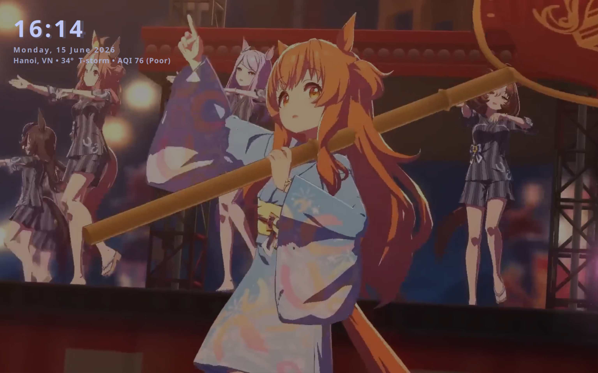
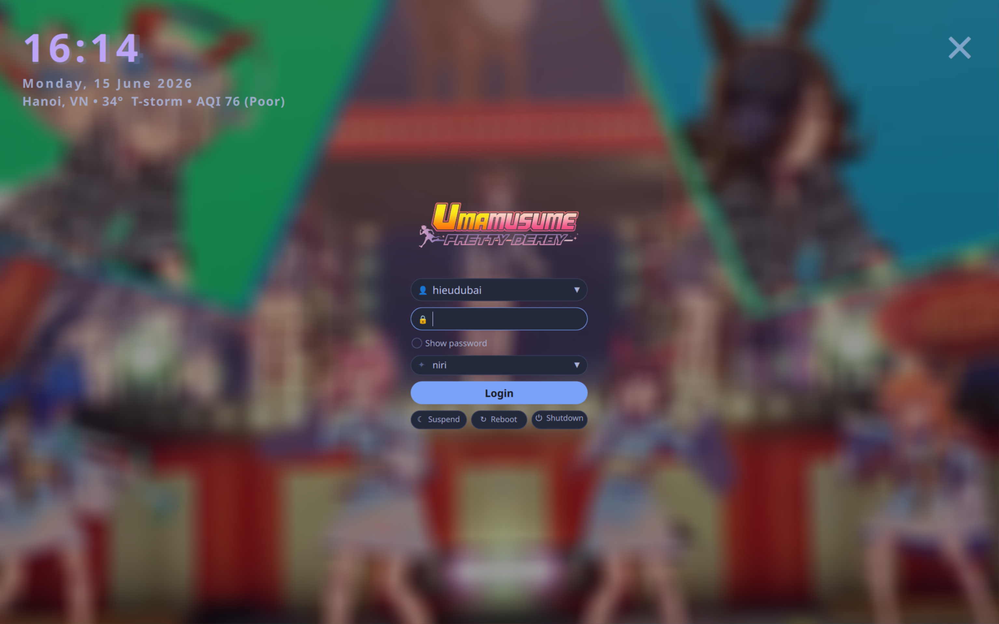

# Tracen Ondo

Theme SDDM hiện đại, tối giản với nền video, đồng hồ, thời tiết & AQI.




## Tính năng

- Nền video động (`background.mp4`)
- Đồng hồ + ngày tháng (cập nhật mỗi giây)
- Thời tiết & AQI (tự động định vị qua ip-api.com + Open-Meteo)
- Danh sách user dropdown (click chọn, không cycle)
- Danh sách session dropdown (chọn DE/WM)
- Đăng nhập bằng phím Enter hoặc click nút Login
- Nút tắt/bật âm thanh nền video
- Hiển thị Caps Lock
- Nút Show/Hide mật khẩu
- Nút tắt máy, khởi động lại, suspend
- Hiệu ứng mờ (GaussianBlur) khi mở hộp đăng nhập
- Tự động chọn user & session gần nhất
- Phím ✕ (góc trên phải) và click chuột phải để đóng hộp đăng nhập

## Yêu cầu

| Thành phần | Gói |
|---|---|
| **SDDM** | `sddm` |
| **Qt6** | `qt6-declarative` (thường đi kèm SDDM) |
| **Qt6 Multimedia** | `qt6-multimedia` + backend (`qt6-multimedia-ffmpeg` hoặc `qt6-multimedia-gstreamer`) |
| **Qt6 5Compat** | `qt6-5compat` (cung cấp `Qt5Compat.GraphicalEffects`) |
| **Qt6 Wayland** | `qt6-wayland` (cho greeter chạy Wayland) |
| **Qt6 Shapes** | Có sẵn trong `qt6-declarative` |

### Font (tuỳ chọn)

| Font | Mục đích | Cài đặt |
|---|---|---|
| M PLUS Rounded 1c | Font chính cho UI | AUR: `ttf-mplus`, hoặc tải từ [Google Fonts](https://fonts.google.com/specimen/M+PLUS+Rounded+1c) |
| Noto Sans JP | Font dự phòng (fallback) | `noto-fonts-cjk` |
| Material Symbols Rounded | Icon audio | **Đã bundle sẵn** trong theme |

> **Lưu ý:** Material Symbols Rounded (`MaterialSymbolsRounded.ttf`, ~15MB) đã được bundle sẵn trong thư mục theme. Nếu không cài M PLUS Rounded 1c, theme sẽ tự động dùng Noto Sans JP hoặc sans-serif làm fallback.

## Cài đặt

### 1. Tải theme

```bash
git clone https://github.com/TheLiems-dev/Tracen_Ondo.git
```

### 2. Copy vào thư mục SDDM themes

```bash
sudo cp -r Tracen_Ondo /usr/share/sddm/themes/
```

### 3. Cài đặt dependencies

<details>
<summary><b>Arch Linux / EndeavourOS / CachyOS</b></summary>

```bash
sudo pacman -S sddm qt6-multimedia qt6-multimedia-ffmpeg qt6-5compat qt6-wayland
# Font (khuyên dùng):
sudo pacman -S noto-fonts-cjk
# M PLUS: yay -S ttf-mplus  # từ AUR
```
</details>

<details>
<summary><b>Fedora</b></summary>

```bash
sudo dnf install sddm qt6-qtmultimedia qt6-qt5compat qt6-qtwayland
# Backend multimedia:
sudo dnf install qt6-qtmultimedia-ffmpeg
# Font:
sudo dnf install google-noto-sans-cjk-fonts mplus-fonts
```
</details>

<details>
<summary><b>Debian / Ubuntu</b></summary>

```bash
sudo apt install sddm qt6-multimedia qt6-5compat qt6-wayland
# Backend multimedia:
sudo apt install qt6-multimedia-ffmpeg
# Font:
sudo apt install fonts-noto-cjk fonts-mplus
```
</details>

<details>
<summary><b>openSUSE</b></summary>

```bash
sudo zypper install sddm qt6-multimedia qt6-qt5compat qt6-wayland
# Font:
sudo zypper install google-noto-sans-cjk-fonts mplus-fonts
```
</details>

<details>
<summary><b>Void Linux</b></summary>

```bash
sudo xbps-install -S sddm qt6-multimedia qt6-5compat qt6-wayland
# Font:
sudo xbps-install -S noto-fonts-cjk mplus-fonts
```
</details>

> **Gỡ rối:** Nếu video không chạy, thử đổi backend Qt Multimedia (cài `qt6-multimedia-gstreamer` thay vì `qt6-multimedia-ffmpeg`). Kiểm tra bằng `journalctl -u sddm -f` để xem log lỗi.

### 4. Cấu hình SDDM

Sửa file `/etc/sddm.conf` (tạo mới nếu chưa có):

```ini
[Theme]
Current=Tracen_Ondo

[General]
InputMethod=
CursorTheme=Adwaita
```

> **Lưu ý:** `CursorTheme=Adwaita` đảm bảo con trỏ chuột đúng theme hệ thống. Có thể đổi thành tên theme con trỏ bạn muốn.

Nếu distro của bạn dùng `sddm.conf.d`:

```bash
echo -e "[Theme]\nCurrent=Tracen_Ondo" | sudo tee /etc/sddm.conf.d/theme.conf
```

### 5. Bật SDDM (nếu chưa)

```bash
sudo systemctl enable sddm --now
```

> **Khuyến cáo:** Nên disable display manager cũ trước: `sudo systemctl disable --now gdm lightdm` (tuỳ theo DM hiện tại).

## Cấu hình

### Thay video nền

Thay file `background.mp4` trong thư mục theme bằng video khác (cùng tên). Không cần sửa code.

### Thay ảnh chào mừng

Thay file `welcome.png` (kích thước khuyên dùng: 360×180px).

### Tự động chọn session mặc định

Trong `Main.qml`, tìm hàm `findSession()` và sửa `"niri"` thành tên session bạn muốn:

```js
if (item && item.name === "niri") {  // sửa "niri" → "plasma", "hyprland", v.v.
```

## Cấu trúc thư mục

```
Tracen_Ondo/
├── Main.qml                    # File theme chính
├── preview.qml                 # File preview (chạy thử bằng sddm-preview)
├── metadata.desktop            # Metadata cho SDDM
├── theme.conf                  # Cấu hình theme (rỗng)
├── background.mp4              # Video nền
├── welcome.png                 # Ảnh chào mừng
├── MaterialSymbolsRounded.ttf  # Font icon (bundle)
├── preview-1.png               # Ảnh preview 1
└── preview-2.png               # Ảnh preview 2
```

## Preview

Chạy thử theme mà không cần logout:

```bash
sddm-preview /usr/share/sddm/themes/Tracen_Ondo/preview.qml
```

> Lưu ý: `sddm-preview` có thể không có sẵn trên một số distro. Cài gói `sddm-tools` (Arch) hoặc tương đương.

## Giấy phép

MIT
